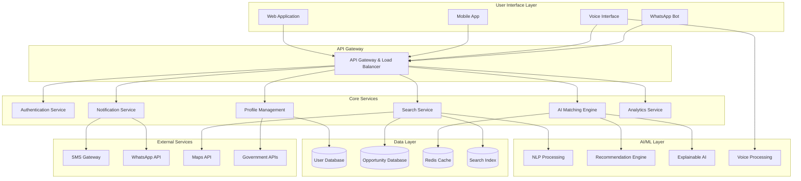

# Design Document: AI Local Opportunity Connector (AILOC)

## Overview

The AI Local Opportunity Connector (AILOC) is a comprehensive platform that bridges the gap between citizens seeking opportunities and providers offering them. The system employs a sophisticated AI matching engine that considers multiple factors including location proximity, skill alignment, demographic eligibility, and user preferences to create meaningful connections.

The platform operates on a three-tier architecture: a user-facing interface supporting multiple languages and input modalities, a core AI processing layer that handles matching and recommendations, and a data management layer that stores user profiles, opportunities, and interaction history.

Key differentiators include real-time opportunity matching, explainable AI recommendations, multi-language voice support, and optimization for low-bandwidth environments common in rural and semi-urban areas.

## Architecture



## Components and Interfaces

### User Interface Components

**Web Application**
- Responsive design optimized for low-bandwidth connections
- Progressive Web App (PWA) capabilities for offline access
- Multi-language support with dynamic language switching
- Voice input integration using Web Speech API

**Mobile Application**
- Native Android/iOS apps with offline-first architecture
- Voice recording and playback capabilities
- Push notification support
- Location services integration

**Voice Interface**
- Speech-to-text processing for local languages
- Natural language understanding for intent extraction
- Text-to-speech response generation
- Fallback mechanisms for recognition failures

### Core Service Components

**Authentication Service**
```python
class AuthenticationService:
    def register_user(self, user_data: UserRegistration) -> AuthResult
    def authenticate(self, credentials: Credentials) -> AuthToken
    def refresh_token(self, refresh_token: str) -> AuthToken
    def logout(self, user_id: str) -> bool
```

**Profile Management Service**
```python
class ProfileService:
    def create_profile(self, user_id: str, profile_data: ProfileData) -> Profile
    def update_profile(self, user_id: str, updates: ProfileUpdates) -> Profile
    def get_profile(self, user_id: str) -> Profile
    def validate_profile_completeness(self, profile: Profile) -> ValidationResult
```

**Search Service**
```python
class SearchService:
    def search_opportunities(self, query: SearchQuery) -> SearchResults
    def filter_by_location(self, opportunities: List[Opportunity], location: Location, radius: int) -> List[Opportunity]
    def filter_by_eligibility(self, opportunities: List[Opportunity], profile: Profile) -> List[Opportunity]
    def rank_results(self, opportunities: List[Opportunity], profile: Profile) -> List[Opportunity]
```

**AI Matching Engine**
```python
class AIMatchingEngine:
    def generate_recommendations(self, user_profile: Profile) -> List[Recommendation]
    def calculate_match_score(self, profile: Profile, opportunity: Opportunity) -> float
    def explain_recommendation(self, recommendation: Recommendation) -> Explanation
    def update_user_preferences(self, user_id: str, feedback: UserFeedback) -> None
```

### AI/ML Components

**NLP Processing Engine**
- Intent classification for user queries
- Entity extraction (location, skills, job types)
- Multi-language support with translation capabilities
- Sentiment analysis for user feedback

**Recommendation Engine**
- Collaborative filtering based on user interactions
- Content-based filtering using opportunity features
- Hybrid approach combining multiple recommendation strategies
- Real-time learning from user behavior

**Explainable AI Module**
- Feature importance calculation for recommendations
- Natural language explanation generation
- Confidence scoring for recommendations
- Bias detection and mitigation

### Data Management Components

**User Database Schema**
```sql
Users: user_id, name, phone, email, location, demographics, created_at
Profiles: user_id, skills, experience, preferences, education, updated_at
UserInteractions: user_id, opportunity_id, interaction_type, timestamp
```

**Opportunity Database Schema**
```sql
Opportunities: opp_id, provider_id, title, description, location, requirements, created_at
Providers: provider_id, name, type, contact_info, verification_status
Applications: user_id, opp_id, status, applied_at, notes
```

## Data Models

### User Profile Model
```python
@dataclass
class Profile:
    user_id: str
    personal_info: PersonalInfo
    location: Location
    skills: List[Skill]
    experience: List[Experience]
    education: List[Education]
    preferences: UserPreferences
    demographics: Demographics
    created_at: datetime
    updated_at: datetime
    
@dataclass
class PersonalInfo:
    name: str
    phone: str
    email: Optional[str]
    age: int
    gender: str
    
@dataclass
class Location:
    latitude: float
    longitude: float
    address: str
    city: str
    state: str
    pincode: str
    
@dataclass
class Skill:
    name: str
    level: SkillLevel  # BEGINNER, INTERMEDIATE, ADVANCED
    verified: bool
    acquired_date: Optional[datetime]
```

### Opportunity Model
```python
@dataclass
class Opportunity:
    opp_id: str
    provider_id: str
    title: str
    description: str
    type: OpportunityType  # JOB, SCHEME, TRAINING, BUSINESS
    location: Location
    requirements: Requirements
    benefits: List[str]
    application_process: List[str]
    deadline: Optional[datetime]
    status: OpportunityStatus
    created_at: datetime
    
@dataclass
class Requirements:
    skills: List[str]
    education: List[str]
    experience_years: Optional[int]
    age_range: Optional[Tuple[int, int]]
    gender_preference: Optional[str]
    location_radius: int  # in kilometers
    
@dataclass
class Recommendation:
    user_id: str
    opportunity: Opportunity
    match_score: float
    explanation: str
    confidence: float
    generated_at: datetime
```

### Search and Matching Models
```python
@dataclass
class SearchQuery:
    text: str
    language: str
    user_id: str
    location: Optional[Location]
    filters: SearchFilters
    
@dataclass
class SearchFilters:
    opportunity_types: List[OpportunityType]
    location_radius: int
    salary_range: Optional[Tuple[int, int]]
    experience_level: Optional[str]
    
@dataclass
class MatchingCriteria:
    location_weight: float = 0.3
    skill_weight: float = 0.4
    experience_weight: float = 0.2
    demographic_weight: float = 0.1
```

## Error Handling

### Error Classification
- **User Input Errors**: Invalid data, missing required fields, format violations
- **System Errors**: Database failures, API timeouts, service unavailability
- **AI/ML Errors**: Model prediction failures, low confidence scores, bias detection
- **Integration Errors**: External API failures, network connectivity issues

### Error Response Strategy
```python
@dataclass
class ErrorResponse:
    error_code: str
    message: str
    user_message: str  # Localized user-friendly message
    suggested_actions: List[str]
    retry_after: Optional[int]
    
class ErrorHandler:
    def handle_validation_error(self, error: ValidationError) -> ErrorResponse
    def handle_system_error(self, error: SystemError) -> ErrorResponse
    def handle_ai_error(self, error: AIError) -> ErrorResponse
    def log_error(self, error: Exception, context: Dict) -> None
```

### Graceful Degradation
- When AI matching fails, fall back to rule-based matching
- When voice recognition fails, provide text input alternatives
- When location services fail, allow manual location entry
- When real-time notifications fail, queue for batch delivery

## Testing Strategy

The testing strategy employs a dual approach combining unit tests for specific scenarios and property-based tests for comprehensive validation of system behaviors.

**Unit Testing Focus:**
- API endpoint validation with specific input/output examples
- Database operations with known test data
- Error handling scenarios with predefined error conditions
- Integration points between services
- Edge cases like empty search results or invalid user input

**Property-Based Testing Focus:**
- Universal properties that must hold across all valid inputs
- AI matching consistency and fairness properties
- Data integrity constraints across all operations
- Search result relevance and ranking properties
- User privacy and security properties

**Testing Configuration:**
- Property tests configured to run minimum 100 iterations per test
- Each property test tagged with format: **Feature: ai-local-opportunity-connector, Property {number}: {property_text}**
- Continuous integration pipeline running both unit and property tests
- Performance testing for low-bandwidth scenarios
- Security testing for data protection compliance

**Test Data Strategy:**
- Synthetic user profiles covering diverse demographics
- Generated opportunities across all types and locations
- Multilingual test data for NLP components
- Edge case data for boundary condition testing

## Correctness Properties

*A property is a characteristic or behavior that should hold true across all valid executions of a system—essentially, a formal statement about what the system should do. Properties serve as the bridge between human-readable specifications and machine-verifiable correctness guarantees.*

Based on the prework analysis and property reflection to eliminate redundancy, the following properties ensure the AILOC system operates correctly across all scenarios:

### Property 1: Profile Management Round Trip
*For any* valid user profile data, creating a profile and then retrieving it should return equivalent data with all required fields populated correctly.
**Validates: Requirements 1.1, 1.2, 1.3**

### Property 2: Profile Validation Completeness
*For any* user profile with missing required fields, the system should identify and prompt for all missing essential information.
**Validates: Requirements 1.5**

### Property 3: Multi-Language Consistency
*For any* supported language input (Telugu, Hindi, Tamil, English), the system should process the input correctly and respond in the same language.
**Validates: Requirements 2.1, 2.2, 2.4**

### Property 4: Voice Processing Fallback
*For any* voice input that fails recognition, the system should provide alternative text input options.
**Validates: Requirements 2.5**

### Property 5: Natural Language Query Understanding
*For any* valid natural language query in supported languages, the system should correctly identify the intent and return relevant results.
**Validates: Requirements 3.4**

### Property 6: Empty Search Result Handling
*For any* search query that yields no matches, the system should provide alternative search suggestions or related opportunities.
**Validates: Requirements 3.5**

### Property 7: Opportunity Lifecycle Management
*For any* valid opportunity posting, the system should store it, make it searchable, and remove it from active recommendations when expired or filled.
**Validates: Requirements 4.1, 4.2, 4.3, 4.5**

### Property 8: Opportunity Validation Requirements
*For any* opportunity posting attempt without required fields (location, eligibility criteria, contact information), the system should reject the posting.
**Validates: Requirements 4.4**

### Property 9: AI Matching Consistency
*For any* user profile and opportunity that meet matching criteria, the system should generate a recommendation with a score that reflects location proximity, skill alignment, and eligibility criteria.
**Validates: Requirements 5.1, 5.2**

### Property 10: Recommendation Ranking Order
*For any* set of recommendations for a user, they should be ordered by relevance score in descending order.
**Validates: Requirements 5.3**

### Property 11: Notification Timing Compliance
*For any* new opportunity that matches a user's profile, a notification should be sent within 24 hours of the opportunity being posted.
**Validates: Requirements 5.4, 9.1**

### Property 12: Learning from User Feedback
*For any* user interaction feedback, the system should update user preferences and improve future recommendation quality.
**Validates: Requirements 5.5**

### Property 13: Recommendation Explainability
*For any* recommendation shown to a user, the system should provide an explanation that identifies specific profile elements (skills, location, demographics) that contributed to the match.
**Validates: Requirements 6.1, 6.3**

### Property 14: Application Guidance Provision
*For any* opportunity selected by a user, the system should provide step-by-step guidance for the application process and actionable next steps.
**Validates: Requirements 6.2, 6.5**

### Property 15: Eligibility Gap Explanation
*For any* opportunity where a user doesn't meet eligibility requirements, the system should explain what specific improvements or changes are needed.
**Validates: Requirements 6.4**

### Property 16: Content Compression Optimization
*For any* media content served by the system, the compressed version should be smaller than the original while maintaining acceptable quality.
**Validates: Requirements 7.2**

### Property 17: Offline Data Accessibility
*For any* previously loaded opportunities, they should remain accessible when the system is offline.
**Validates: Requirements 7.3**

### Property 18: Network Failure Recovery
*For any* failed data transfer, the system should retry with optimized payloads that are smaller than the original request.
**Validates: Requirements 7.5**

### Property 19: Location-Based Search Prioritization
*For any* search query, results should be ordered by distance from the user's location, with opportunities within 50km radius prioritized by default.
**Validates: Requirements 8.1**

### Property 20: Location Service Integration
*For any* user with location services enabled, the system should automatically use their current location for searches unless overridden.
**Validates: Requirements 8.2, 8.3**

### Property 21: Distance Information Display
*For any* opportunity shown to a user, the system should calculate and display the distance from the user's location.
**Validates: Requirements 8.4**

### Property 22: Transportation Information Provision
*For any* opportunity that requires travel beyond walking distance, the system should indicate transportation options or requirements.
**Validates: Requirements 8.5**

### Property 23: Deadline Reminder Notifications
*For any* opportunity with an approaching deadline that a user has shown interest in, the system should send reminder notifications before the deadline.
**Validates: Requirements 9.2**

### Property 24: Notification Preference Adherence
*For any* user with specified notification preferences, all notifications should follow their chosen frequency and channel settings.
**Validates: Requirements 9.4**

### Property 25: Urgent Alert Timing
*For any* opportunity about to expire that matches interested users, urgent alerts should be sent with sufficient time for users to respond.
**Validates: Requirements 9.5**

### Property 26: Analytics Accuracy
*For any* provider dashboard, the displayed metrics (views, applications, matches) should accurately reflect the actual interaction data for their opportunities.
**Validates: Requirements 10.1, 10.2**

### Property 27: Report Content Completeness
*For any* generated analytics report, it should include all specified metrics: success rates, time-to-fill, geographic reach data, and demographic breakdowns.
**Validates: Requirements 10.3**

### Property 28: Data Export Functionality
*For any* analytics data requested for export, the system should generate files in standard formats (CSV, JSON, PDF) that contain accurate data.
**Validates: Requirements 10.4**

### Property 29: Performance Benchmarking
*For any* opportunity performance comparison request, the system should provide benchmarking data against similar opportunities in the same category and location.
**Validates: Requirements 10.5**

### Property 30: Data Encryption Security
*For any* sensitive user data stored in the system, it should be encrypted using industry-standard encryption methods.
**Validates: Requirements 11.1**

### Property 31: Role-Based Access Control
*For any* user attempting to access data or functionality, the system should only allow access to resources appropriate for their role and permissions.
**Validates: Requirements 11.2**

### Property 32: Data Deletion Compliance
*For any* user data deletion request, all personal information should be completely removed from the system within 30 days.
**Validates: Requirements 11.3**

### Property 33: Audit Logging Completeness
*For any* access to user data, the system should create audit log entries with timestamp, user ID, action performed, and data accessed.
**Validates: Requirements 11.4**

### Property 34: Breach Notification Timing
*For any* detected data breach affecting user data, notifications should be sent to affected users within 72 hours of detection.
**Validates: Requirements 11.5**

### Property 35: API Validation and Processing
*For any* opportunity posted via external API, the system should validate the data according to the same rules as manual postings and process valid submissions automatically.
**Validates: Requirements 12.2**

### Property 36: Webhook Notification Reliability
*For any* opportunity status change, registered webhooks should be triggered with accurate status information and delivery should be attempted with retry logic.
**Validates: Requirements 12.3**